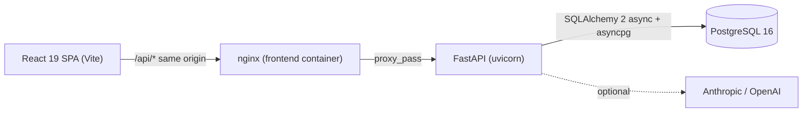

# Architecture

Decisions, with the reason for each. Where a choice was between two reasonable options, the one not taken is named.

## Shape

In production-like mode the browser only ever talks to nginx, so there is no CORS surface and one origin to secure later. In development Vite's proxy plays the same role.

## Backend

- **Layering.** Routers parse and return Pydantic schemas; services own queries and rules; models are SQLAlchemy only. Nothing in a router touches the session beyond passing it along, which keeps endpoint tests cheap and services reusable from a future worker or CLI.
- **Validation lives in Pydantic, once.** `PatientInput` carries every rule (date of birth plausibility, phone digits, blank-to-null, tag de-duplication). FastAPI's `RequestValidationError` is translated into one error envelope, `{"detail", "errors": [{"field", "message"}]}`, so the frontend maps server errors onto form fields without special cases. The default 422 schema is overridden in the OpenAPI document to reflect this.
- **Pagination and sorting are server-side** with a whitelist of sort fields and stable tie-breakers (`last_name, first_name, id`), so page boundaries never show a row twice. `age` sorts invert the `date_of_birth` direction. Indexes back every filter and sort column (see `DATA_MODEL.md`).
- **Migrations are the schema.** Alembic with a hand-written initial revision and a working `downgrade`; `start.sh` runs `alembic upgrade head` before uvicorn. Seeding is idempotent and happens in the app lifespan, so a fresh database is populated on first boot and never duplicated.
- **Summary provider protocol.** `SummaryProvider.narrative(patient, notes)` has a template implementation that always works offline and two thin HTTP implementations (Anthropic, OpenAI) selected by `SUMMARY_PROVIDER`. A provider failure falls back to the template and the response says so in `generated_by`. The SDKs were skipped on purpose: two `httpx` calls are easier to read than two dependency trees.
- **Request logging** records method, path, status, and duration, and never query strings or bodies, since those can carry patient data.

## Frontend

- **Visual system.** Warm off-white canvas with a white content panel, hairline borders, warm greys, black primary buttons, and lavender as the single accent. One typeface (Inter). Status is a pastel-tinted chip whose text carries the meaning. Three layout patterns recur: a breadcrumb top bar fed by each page through `useBreadcrumbs`, a label-over-value `FactGrid` for record headers, and a right-side drawer (`PatientDrawer`) for previewing a record without leaving the list. The dashboard is a "statuses" view: metric tiles, then the roster grouped by status with collapsible headers. Every token lives in `src/index.css`, so the whole look is one file.
- **Server state is TanStack Query; UI state is tiny.** Lists, patients, notes, summary, and stats are all query options with explicit keys. Mutations invalidate exactly the keys they affect (a note touches notes, the summary, the patient, and the lists). Zustand holds only the theme and sidebar state. Nothing copies server data into a store.
- **Search, sort, status, and page live in the URL.** TanStack Router validates them with a zod schema and strips defaults, so a filtered view is shareable and the back button works. The search box keeps local text, debounces 250 ms, then writes to the URL; `keepPreviousData` keeps the old rows on screen while the next page loads, which is what makes search feel non-blocking.
- **Virtualized rows.** `@tanstack/react-virtual` renders only the visible rows of a page (page size up to 100), and `PatientRow` is memoized because the virtualizer re-renders on every scroll tick.
- **Types come from the API.** `openapi-typescript` generates `schema.d.ts` from the committed `openapi.json`, and `openapi-fetch` uses those types for paths, params, and bodies. Changing a response shape on the backend is a compile error on the frontend. CI fails if either generated file is stale.
- **Forms.** `react-hook-form` with a zod schema that mirrors the backend rules so most errors appear before a request is made. Server 422 field errors are applied with `setError`; a 422 that matches no field, and any network failure, render an inline `ErrorState` with a retry. Success is only ever reported after the server confirms it.
- **Accessibility as a floor, not a feature.** Every control is labelled, errors are tied to fields with `aria-describedby`, loading states use `role="status"`, status is never color alone, focus is always visible, the sidebar collapses into a focus-trapped sheet, and axe runs in CI on every screen in light and dark. Touch targets grow to 44px on coarse pointers.
- **Motion is contained.** The `/welcome` landing is a separate lazy route and the only place that imports `motion/react`; a unit test enforces that boundary. Scroll-linked and 3D effects animate only `transform` and `opacity`, parallax is capped at 24px, and `prefers-reduced-motion` renders the final pose with no scroll binding. Dashboard screens use transitions under 200 ms.

## Scale

A dedicated agent reviewed the code against 100k users and 1M visits; the result is in `SCALABILITY.md`. The design choices it drove: worker processes with an advisory-locked seed, per-worker pools with statement timeouts, trigram and composite indexes behind every search and sort, ETag revalidation, a short-TTL cache for dashboard aggregates, per-client rate limits, request IDs end to end, request cancellation in the browser, and a gzip bundle budget in CI. The summary endpoint releases its database connection before calling an LLM. What a single node cannot provide (replicas, shared cache, CDN, autoscaling) is listed as next steps rather than implied.

## Testing

- **pytest** hits the real schema: a session fixture runs `alembic downgrade base` then `upgrade head` on a test database and truncates between tests. Tests cover status codes, the error envelope, pagination math, search, sorting, cascade deletes, and summary content.
- **Vitest** covers pure logic (form schema, formatting) and the components whose behavior is easy to get wrong (debounced search, tag input, error state).
- **Playwright** walks the coordinator journeys end to end against the dev servers, intercepts requests to simulate server validation errors and lost connections, checks axe on every route in light and dark, checks horizontal overflow on every route at 320px, and verifies the landing's reduced-motion fallback.

## CI

Seven checks per pull request, each mirrored by a `scripts/verify.sh` section: title format, lint and types, backend unit, frontend unit, API contract, end to end, and a Docker Compose build with a health smoke test. Actions are pinned by SHA. Sharding thresholds and current timings are recorded in `CI.md`; nothing is sharded yet because the slowest suite runs in about 35 seconds.

## What would come next

- Authentication and roles (the assignment mentions multiple user types); the service layer and error envelope are ready for a `current_user` dependency.
- Coded vocabularies for conditions and allergies instead of free text, once the practice needs reporting across patients.
- Real-time updates with server-sent events on the notes list, which TanStack Query can consume by invalidating the affected keys.
- Per-worker data isolation in the Playwright suite before enabling sharding.
