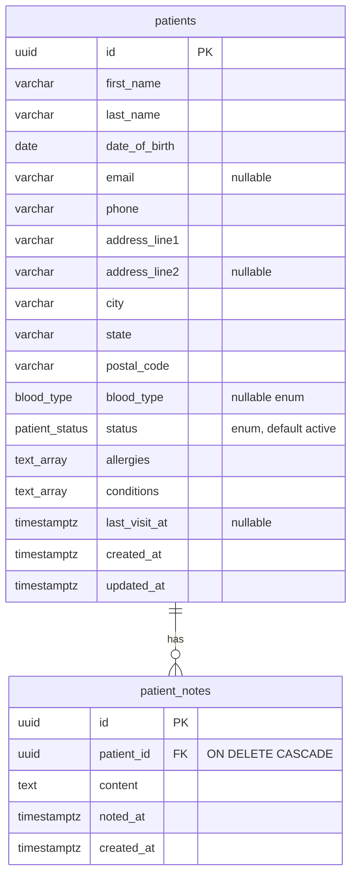

# Data model

Owned by `database-engineer`. Schema changes ship as Alembic revisions in `backend/alembic/versions/`, each with a working `downgrade`.



## Enums

- `patient_status`: `active`, `pending`, `inactive`, `discharged`. Describes the record, not acuity.
- `blood_type`: `A+`, `A-`, `B+`, `B-`, `AB+`, `AB-`, `O+`, `O-`. Nullable because intake often precedes typing.

## Indexes

| Index | Columns | Serves |
| --- | --- | --- |
| `ix_patients_last_name` | `last_name` | name search and default sort |
| `ix_patients_status` | `status` | status filter and the status chart |
| `ix_patients_last_visit_at` | `last_visit_at` | sort by last visit |
| `ix_patient_notes_patient_id_noted_at` | `(patient_id, noted_at DESC)` | notes list for one patient, newest first |

## Decisions

- Age is derived from `date_of_birth` at read time rather than stored.
- `allergies` and `conditions` are `text[]`. A lookup table would be the next step if the practice needs coded vocabularies (ICD-10, SNOMED); for a single-practice dashboard free text keeps the form simple.
- `noted_at` is the clinical time the note refers to and is supplied by the client. `created_at` is when the row was written.
- Deleting a patient cascades to notes at the database level, so the API does not need a second delete.

## Seed

`backend/app/seed/sample_patients.py` holds 20 fictional patients with 35 notes. `seed_if_empty` inserts them only when `patients` has no rows, so restarting the API never duplicates data.

## Recreating the database

```bash
cd backend
uv run alembic upgrade head      # apply schema
uv run alembic downgrade base    # remove it
```

Docker Compose runs `alembic upgrade head` before starting the API.
